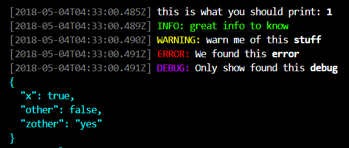

# ${pkg.name}

${badge('npm')} ${badge('npm-license')} ${badge('github-issues')}

${pkg.description}

${badge('nodei')}

${badge('travis-status')}
${badge('github-stars')}
${badge('github-forks')}

${badge('github-forks')}

${badge('dependencies')}
${badge('devDependencies')}

## Features

- Parse text with chords

## Usage

```js
const logger = require('pkg.name');

logger.print('this is what you should print: %s', 1);
logger.info('great info to %s', 'know');
logger.warn('warn me of this %s', 'stuff');
logger.error('We found this %s', 'error');
logger.debug('Only show found this %s', 'debug'); // --debug args needed
logger.data({x: true, other: false, zother: 'yes'})
```



## Install

`npm install --save ${pkg.name}`


## Scripts

${scripts()}

## Dependencies

${dependencies()}

## Contributing

Contributions welcome; Please submit all pull requests against the master branch. If your pull request contains TypeScript patches or features, you should include relevant unit tests. Please check the [Contributing Guidelines](contributng.md) for more details. Thanks!

## Author

${author()}

## License

${license()}