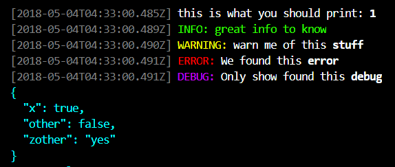

# great-logs

  


## Features

- Parse text with chords

## Usage

```js
const logger = require('pkg.name');

logger.print('this is what you should print: %s', 1);
logger.info('great info to %s', 'know');
logger.warn('warn me of this %s', 'stuff');
logger.error('We found this %s', 'error');
logger.debug('Only show found this %s', 'debug'); // --debug args needed
logger.data({x: true, other: false, zother: 'yes'})
```



## Install

`npm install --save great-logs`


## Scripts

 - **npm run build** : `rm -rf dist && tsc`
 - **npm run test** : `mocha ./dist/test/*.js`

## Dependencies

Package | Version | Dev
--- |:---:|:---:
[args-finder](https://www.npmjs.com/package/args-finder) | 0.0.3 | ✖
[chalk](https://www.npmjs.com/package/chalk) | ^2.4.1 | ✖
[@types/node](https://www.npmjs.com/package/@types/node) | ^10.0.2 | ✔
[@types/chai](https://www.npmjs.com/package/@types/chai) | ^4.1.3 | ✔
[@types/mocha](https://www.npmjs.com/package/@types/mocha) | ^5.2.0 | ✔
[chai](https://www.npmjs.com/package/chai) | ^4.1.2 | ✔
[mocha](https://www.npmjs.com/package/mocha) | ^5.1.1 | ✔


## Contributing

Contributions welcome; Please submit all pull requests against the master branch. If your pull request contains TypeScript patches or features, you should include relevant unit tests. Please check the [Contributing Guidelines](contributng.md) for more details. Thanks!

## Author

Wendly Saintil <wendlysaintil@gmail.com> https://twitter.com/wendlysaintil

## License

 - **MIT** : http://opensource.org/licenses/MIT